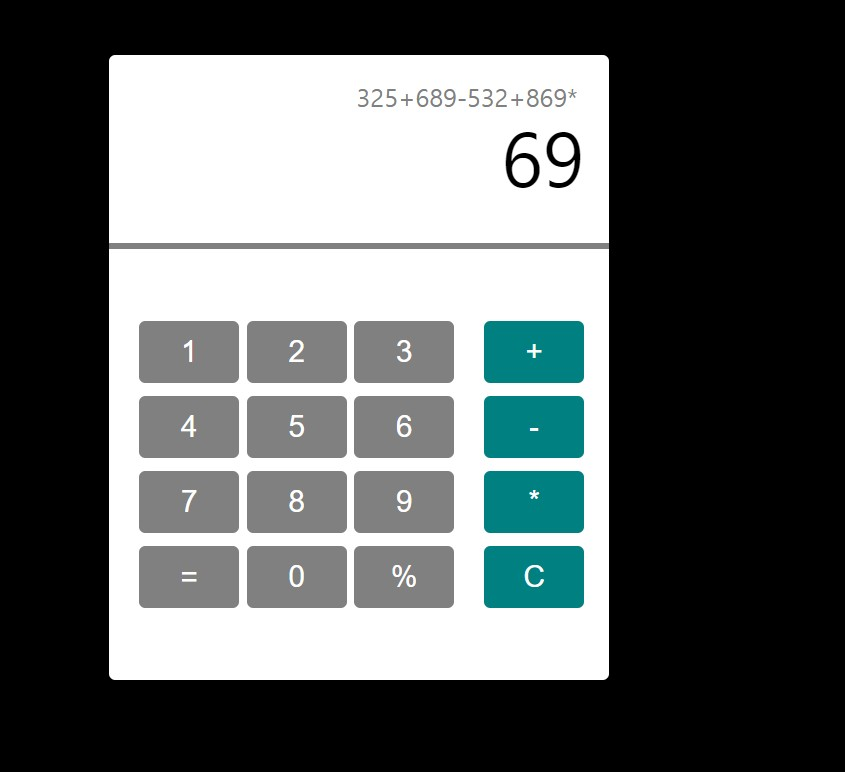

# Calculator

<ol>
  <li><strong>프로젝트 이름:</strong> Calculator(계산기)</li>
  <li><strong>사용 언어:</strong> HTML, CSS, JavaScript</li>
  <li><strong>주요 기능:</strong>
    <ul>
      <li> +, -, *, 나누기 등 다양한 연산이 가능합니다.</li>
      <li> C를 누르면 입력값이 삭제됩니다. </li>
      <li> 현재의 입력값은 주 스크린에 표시되며, 그동안의 입력값은 그 위 보조 스크린에 표시됩니다. </li>
      <li> =을 누르면 최종 연산 값이 표시됩니다. </i>
    </ul>
  </li>
  <li><strong>배우고 느낀점:</strong>
  <ul>
    <li> 간단한 문제를 너무 어렵게 꼬아버렸나 싶은 생각이 들었음</li>
    <li> 코딩에서 왜 기획과 문제정의 능력이 중요한지 알게됨. 단순히 '하다보면 되겠지'하고 달려들면 문제만 더욱 꼬여버림</li>
    <li> 다음부터는 잠깐이라도 시간을 갖고 차분히 문제를 정의하며 어떻게 접근할지 생각해봐야겠음 </li>
    <li>연산을 위해서는 string으로 개별 입력된 숫자들을 조합하고, 이를 다시 number로 바꾸는 과정이 필요했음. </li>
    <li> 어렵고 부딪혔던 부분은 아래와 같음 
      <ol>   
        <li> 단순히 두 값을 계산하는 것이 아닌 무한히 계속 연산이 가능하도록 하기위해 A + B = A처럼 연산값을 다시 A에 집어놓도록 구성했음.</li>
        <li> 처음에는 oval을 이용해 문자열끼리 연산을 시키고 싶었지만, 위험하고 안정적이지 않은 기능이라는 것을 알게됨. </li>
        <li> 가장 어려웠던 부분은 = 이었음. 지금까지의 저장된 모든 연산을 해내야했고 동시에 모든 값을 초기화시켜야했음. </li>
      </ol>
    </li>
  </ul>
</ol>
 

